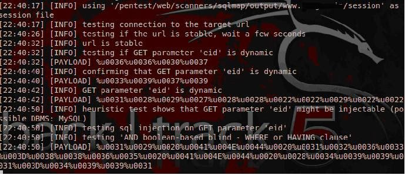

##ABSTRACT

Most cyber-attacks in the world that involve websites occurs due to lack of updates and the failure to validate the user input. Starting from buffer overflow vulnerability, which is a system level vulnerability up to the vulnerabilities that exist today, the fundamental problem has always been the input validation. One of the main threats is SQL Injection that left many worried about their application and databases. The problem is more then a decade old, but still is present inside lots of websites. SQL injection like all other major web application security problems fall in the category of input validation attacks.

##CONTEXT

Many web developers do not know how SQL queries can be handled and assume that an SQL query is a trusted command. This allows for SQL queries to circumvent access controls, thereby bypassing standard authentication and authorization checks. And sometimes SQL queries even may allow access to the command shell on the server operating system level.

Direct injection of SQL commands is a technique where an attacker creates or alters existing SQL commands to expose hidden data or to override valuable data, and even to execute dangerous system level commands on the server.

##INTRODUCTION

Structured Query Language is the standard declarative language for relational databases. This allows for its simplicity and ease of use. SQL was originally developed in the early 70s at IBM labs. SQL Is used by applications communicate or speak with the database.

SQL use the following four statements to communicate with the database.

**SELECT** – Retrieve a record from the database.

**INSERT** -  Inserting a record inside the database.

**DELETE** – Deleting a record from database.

**UPDATE**  - Update or change a current record

The  SQL Injection simply occurs when the user query is treated as the database query. Take an example of how a user is authenticated on a website. The user sends a "Username" and "Password", the username/password is checked against what is present inside the database. If that matches, the user is logged in, else the user is not logged. Here is an example of the basic SQL query that is constructed at the back end.

**The Code:**

`SELECT * FROM user WHERE username = ‘$username’ AND password = ‘$password' `

The query simply says select all from the user table where the username is equal to what the user entered and the password being that the user entered. So, in case where the user supplies the username to be "admin" and password to be "12345". Here is how the SQL query is contructed.

`SELECT * FROM user WHERE username = ‘admin’ AND password = ‘12345' `

**The Injection**

So, what if a user enters something like ' or '1'='1, since the first quote would terminate the input string, the rest of the query would be executed as a SQL query and in a SQL query 1=1 is always a true statement. Which would enable us to bypass the login mechanism

`SELECT * FROM user WHERE username = ‘admin’ AND password = ‘’ or ‘1’=‘1' – TRUE `

The above demonstrates a simple example of SQL injection, however SQL injection in real world is really complicated sometimes and in our penetration tests, most of the times we have a very tight schedule. So therefore, we need an automated/context aware tool to perform the injection for us.

SQLMAP is a tool that can be used to exploit this type of vulnerability. It is Open source, and often is used for Penetration Testing that enable intrusions on fragile DBMS written in Python. It provides functions to detect and exploit vulnerabilities of SQLI. Let's use the example sqlmap.py, widely used in operating systems and databases.

##STEP BY STEP

Readers I will try to explain this in the simplest possible way.

The most common way of testing a SQL injection vulnerability is by inputting a single quote (') inside the input and expect it to display an error. Some of the applications do not return an error. This is where we can utilize true/false statements to check if an application is vulnerable to a SQL injection attack or not.

To find a random website vulnerable to SQL injection, you can utilize the following google dork Example: inurl: news.php id = 1?
There is a bank of google dorks data and several other possibilities that can be used to filter your search. So let's start with SQL map.

Navigate to the following directory inside of backtrack:

`cd /pentest/database/sqlmap`

We will now begin the game, to view the menu for sqlmap.py use the command ./sqlmap.py -h

Let's run sqlmap.py, the parameter [--dbs], to search the all databases in DBMS.

Or use the parameter --current-db to show the databases that are being used. 

The parameter -D is for the target of database and --tables is tables list. 

We will verify the existence of interesting information in the table (admin_users), time to list the columns. The parameter is –columns. 

It is important to always indicate the target database (-D) data before listing the tables because if you do not do this (without the -D) it will list all tables in all databases. 

-T = target table 

-C = target columns, can be more than one column to be chosen. Example: username, password. 

--dump = obtain, extract data. 

Important to remember the parameter --proxy: enables use of proxy. 

Example:     /sqlmap.py --url "http://testphp.vulnweb.com/listproducts.php?cat=1" --dbs --proxy=http://183.223.10.108:80 

Readers, I think that's the basics for beginners. sqlmap.py also has many interesting functions, I suggest researching about --prefix=PREFIX, --postfix=POSTFIX and takeover options. More information about the program and videos of them in action on the official site. 

--dump is to extract the data from the site but is not given any, this must be within the selected column, and you have to choosen what to extract from the column, where I extracted the logins and passwords are saved within the column.

Generally, the field of "passwords" DBMS are encrypted. Most common encryptions used are SHA-1, MD5 hashes and most of the time the hashes are not salted, making it easier to crack. We then need to decrypt the passwords in order to access the target system. We can utilize online hash databases such as  http://www.md5decrypt.org, https://crackstation.net/,http://www.onlinehashcrack.com/ to name a few. The second option is to manually try bruteforcing the password or utilize a commonly known technique rainbow tables for cracking the password hashes. Furthur more you can also try utilizing your GPU power to fasten the process, but unfortunately that's not the scope of this article. 

##BEYOND THE BASICS

Readers, lucky for us, there are some awesome tamper scripts for sqlmap, which can be found in the latest development version from the Subversion repository.

svn checkout https://svn.sqlmap.org/sqlmap/trunk/sqlmap sqlmap-dev

In fact the function of the tamper scripts is to modify the request in a way that will escape detection rules WAF (Web Application Firewall). In some cases it may be necessary to combine some tamper scripts together in order to fool the WAF. For a complete list of scripts for tampering, you may find https://svn.sqlmap.org/sqlmap/trunk/sqlmap/tamper/

Many enterprises often overlook the current vulnerabilities and rely only on the firewall for protection. Unfortunately, most, if not all firewalls can be bypassed by simply utilizing some of the encoding techniques that a sql server understands. So gentlemen, I want to demonstrate how to use some of the new features of sqlmap to bypass WAF’s/IDS.

Well, I'll demonstrate some important scripts that are charencode.py and charcodeencode.py to work with MySQL. The scripts can be found inside of /pentest/web/scanners/sqlmap directory inside of backtrack 5. 

Hands-on: To begin using tamper scripts, you use the --tamper followed by the script name. Inside the screenshot, we have used the charencode command. 

**Summary of charencode.py**

Quite simply, this script is useful for ignoring very weak web application firewalls (WAF) … Another interesting function url-decode the request before processing it through their set of rules (: The web server will anyway go to url-decoded back version, concluding, it should work against any DBMS. 

Example to use:

Another great script is the **charunicodeencode.py**, during my penetration tests this particular script has really helped me in bypassing lots of firewall restrictions. 

Guys, I have demonstrated just a few of the many tamper scripts. We highly recommend testing them out as each one can be used in different situations.

**Notes: That's not a tool for "script kiddies" it is of utmost importance to make use of such a powerful tool responsibly and maturely.**

Caution if used in the wrong way, sqlmap generates many queries and can affect the performance of the database target, moreover strange entries and changes to the database schema are possible if the tool is not controlled and used extensively.

##PARTLY ANONYMOUS

Gentlemen I will demonstrate to you how to use sqlmap with The Onion Router for the protection of IP, DNS, etc... In your Linux, in the terminal type:
$ sudo apt-get install tor tor-geoip

After enter the sqlmap folder and type:
`./sqlmap.py -u "http://www.targetvuln.com/index.php?cata_id=1" -b -a –tor --check-tor--user-agent="Mozilla/5.0 (compatible; Googlebot/2.1; +http://www.google.com/bot.html)"`

The argument --tor invokes the Tor to be used and the --check-tor checks if Tor is being used properly, if not, you will receive an error message in red at the terminal. The User Agent is the googlebot, all your requests on the site will look like the Google bot doing a little visit.

TOR at SQLMap, we can set your TOR proxy for hiding the source from where the traffic or request is generated.

**–tor-port, –tor-type** :  the parameter can help you out to set the TOR proxy manually.
–check-tor : the parameter will check if the tor setup is appropriate and functional.

##CONCLUSION

It is known that many targets have been explored through SQL Injection a few years ago when this threat was discovered, the injection form was "the nail". The pentester had to construct the SQL queries manually.

Then came the development of programs that automated attack. Nowadays perhaps the best known of these programs is sqlmap.py. SQLMAP is a program of open source testing framework written in Python. It has full support for database systems: MySQL, Oracle, PostgreSQL, Microsoft SQL Server, Microsoft Access, IBM DB2, SQLite, Firebird, Sybase, SAP MaxDB and also supports 6 types of SQL Injection techniques.

##SOLUTION

1. Correct the SQL server regularly.
2. Limit the use of dynamic queries.
3. Escape input data from users.
4. Stores the credentials of the database in a separate file.
5. Use the principle of least privilege.
6. Use prepared statements

A Big hug for my dear brother Rafay Baloch and all followers of the RHA. 

*via*：http://www.rafayhackingarticles.net/2014/03/introduction-to-sqlmap-and-firewall.html

*Copy:*

##ABSTRACT

Most cyber-attacks in the world that involve websites occurs due to lack of updates and the failure to validate the user input. Starting from buffer overflow vulnerability, which is a system level vulnerability up to the vulnerabilities that exist today, the fundamental problem has always been the input validation. One of the main threats is SQL Injection that left many worried about their application and databases. The problem is more then a decade old, but still is present inside lots of websites. SQL injection like all other major web application security problems fall in the category of input validation attacks.

##CONTEXT

Many web developers do not know how SQL queries can be handled and assume that an SQL query is a trusted command. This allows for SQL queries to circumvent access controls, thereby bypassing standard authentication and authorization checks. And sometimes SQL queries even may allow access to the command shell on the server operating system level.

Direct injection of SQL commands is a technique where an attacker creates or alters existing SQL commands to expose hidden data or to override valuable data, and even to execute dangerous system level commands on the server.

##INTRODUCTION

Structured Query Language is the standard declarative language for relational databases. This allows for its simplicity and ease of use. SQL was originally developed in the early 70s at IBM labs. SQL Is used by applications communicate or speak with the database.

SQL use the following four statements to communicate with the database.

**SELECT** – Retrieve a record from the database.

**INSERT** -  Inserting a record inside the database.

**DELETE** – Deleting a record from database.

**UPDATE**  - Update or change a current record

The  SQL Injection simply occurs when the user query is treated as the database query. Take an example of how a user is authenticated on a website. The user sends a "Username" and "Password", the username/password is checked against what is present inside the database. If that matches, the user is logged in, else the user is not logged. Here is an example of the basic SQL query that is constructed at the back end.

**The Code:**

`SELECT * FROM user WHERE username = ‘$username’ AND password = ‘$password' `

The query simply says select all from the user table where the username is equal to what the user entered and the password being that the user entered. So, in case where the user supplies the username to be "admin" and password to be "12345". Here is how the SQL query is contructed.

`SELECT * FROM user WHERE username = ‘admin’ AND password = ‘12345' `

**The Injection**

So, what if a user enters something like ' or '1'='1, since the first quote would terminate the input string, the rest of the query would be executed as a SQL query and in a SQL query 1=1 is always a true statement. Which would enable us to bypass the login mechanism

`SELECT * FROM user WHERE username = ‘admin’ AND password = ‘’ or ‘1’=‘1' – TRUE `

The above demonstrates a simple example of SQL injection, however SQL injection in real world is really complicated sometimes and in our penetration tests, most of the times we have a very tight schedule. So therefore, we need an automated/context aware tool to perform the injection for us.

SQLMAP is a tool that can be used to exploit this type of vulnerability. It is Open source, and often is used for Penetration Testing that enable intrusions on fragile DBMS written in Python. It provides functions to detect and exploit vulnerabilities of SQLI. Let's use the example sqlmap.py, widely used in operating systems and databases.

##STEP BY STEP

Readers I will try to explain this in the simplest possible way.

The most common way of testing a SQL injection vulnerability is by inputting a single quote (') inside the input and expect it to display an error. Some of the applications do not return an error. This is where we can utilize true/false statements to check if an application is vulnerable to a SQL injection attack or not.

To find a random website vulnerable to SQL injection, you can utilize the following google dork Example: inurl: news.php id = 1?
There is a bank of google dorks data and several other possibilities that can be used to filter your search. So let's start with SQL map.

Navigate to the following directory inside of backtrack:

`cd /pentest/database/sqlmap`

We will now begin the game, to view the menu for sqlmap.py use the command ./sqlmap.py -h

Let's run sqlmap.py, the parameter [--dbs], to search the all databases in DBMS.

Or use the parameter --current-db to show the databases that are being used. 

The parameter -D is for the target of database and --tables is tables list. 

We will verify the existence of interesting information in the table (admin_users), time to list the columns. The parameter is –columns. 

It is important to always indicate the target database (-D) data before listing the tables because if you do not do this (without the -D) it will list all tables in all databases. 

-T = target table 

-C = target columns, can be more than one column to be chosen. Example: username, password. 

--dump = obtain, extract data. 

Important to remember the parameter --proxy: enables use of proxy. 

Example:     /sqlmap.py --url "http://testphp.vulnweb.com/listproducts.php?cat=1" --dbs --proxy=http://183.223.10.108:80 

Readers, I think that's the basics for beginners. sqlmap.py also has many interesting functions, I suggest researching about --prefix=PREFIX, --postfix=POSTFIX and takeover options. More information about the program and videos of them in action on the official site. 

--dump is to extract the data from the site but is not given any, this must be within the selected column, and you have to choosen what to extract from the column, where I extracted the logins and passwords are saved within the column.

Generally, the field of "passwords" DBMS are encrypted. Most common encryptions used are SHA-1, MD5 hashes and most of the time the hashes are not salted, making it easier to crack. We then need to decrypt the passwords in order to access the target system. We can utilize online hash databases such as  http://www.md5decrypt.org, https://crackstation.net/,http://www.onlinehashcrack.com/ to name a few. The second option is to manually try bruteforcing the password or utilize a commonly known technique rainbow tables for cracking the password hashes. Furthur more you can also try utilizing your GPU power to fasten the process, but unfortunately that's not the scope of this article. 

##BEYOND THE BASICS

Readers, lucky for us, there are some awesome tamper scripts for sqlmap, which can be found in the latest development version from the Subversion repository.

svn checkout https://svn.sqlmap.org/sqlmap/trunk/sqlmap sqlmap-dev

In fact the function of the tamper scripts is to modify the request in a way that will escape detection rules WAF (Web Application Firewall). In some cases it may be necessary to combine some tamper scripts together in order to fool the WAF. For a complete list of scripts for tampering, you may find https://svn.sqlmap.org/sqlmap/trunk/sqlmap/tamper/

Many enterprises often overlook the current vulnerabilities and rely only on the firewall for protection. Unfortunately, most, if not all firewalls can be bypassed by simply utilizing some of the encoding techniques that a sql server understands. So gentlemen, I want to demonstrate how to use some of the new features of sqlmap to bypass WAF’s/IDS.

Well, I'll demonstrate some important scripts that are charencode.py and charcodeencode.py to work with MySQL. The scripts can be found inside of /pentest/web/scanners/sqlmap directory inside of backtrack 5. 

Hands-on: To begin using tamper scripts, you use the --tamper followed by the script name. Inside the screenshot, we have used the charencode command. 

**Summary of charencode.py**

Quite simply, this script is useful for ignoring very weak web application firewalls (WAF) … Another interesting function url-decode the request before processing it through their set of rules (: The web server will anyway go to url-decoded back version, concluding, it should work against any DBMS. 

Example to use:

Another great script is the **charunicodeencode.py**, during my penetration tests this particular script has really helped me in bypassing lots of firewall restrictions. 

Guys, I have demonstrated just a few of the many tamper scripts. We highly recommend testing them out as each one can be used in different situations.

**Notes: That's not a tool for "script kiddies" it is of utmost importance to make use of such a powerful tool responsibly and maturely.**

Caution if used in the wrong way, sqlmap generates many queries and can affect the performance of the database target, moreover strange entries and changes to the database schema are possible if the tool is not controlled and used extensively.

##PARTLY ANONYMOUS

Gentlemen I will demonstrate to you how to use sqlmap with The Onion Router for the protection of IP, DNS, etc... In your Linux, in the terminal type:
$ sudo apt-get install tor tor-geoip

After enter the sqlmap folder and type:
`./sqlmap.py -u "http://www.targetvuln.com/index.php?cata_id=1" -b -a –tor --check-tor--user-agent="Mozilla/5.0 (compatible; Googlebot/2.1; +http://www.google.com/bot.html)"`

The argument --tor invokes the Tor to be used and the --check-tor checks if Tor is being used properly, if not, you will receive an error message in red at the terminal. The User Agent is the googlebot, all your requests on the site will look like the Google bot doing a little visit.

TOR at SQLMap, we can set your TOR proxy for hiding the source from where the traffic or request is generated.

**–tor-port, –tor-type** :  the parameter can help you out to set the TOR proxy manually.
–check-tor : the parameter will check if the tor setup is appropriate and functional.

##CONCLUSION

It is known that many targets have been explored through SQL Injection a few years ago when this threat was discovered, the injection form was "the nail". The pentester had to construct the SQL queries manually.

Then came the development of programs that automated attack. Nowadays perhaps the best known of these programs is sqlmap.py. SQLMAP is a program of open source testing framework written in Python. It has full support for database systems: MySQL, Oracle, PostgreSQL, Microsoft SQL Server, Microsoft Access, IBM DB2, SQLite, Firebird, Sybase, SAP MaxDB and also supports 6 types of SQL Injection techniques.

##SOLUTION

1. Correct the SQL server regularly.
2. Limit the use of dynamic queries.
3. Escape input data from users.
4. Stores the credentials of the database in a separate file.
5. Use the principle of least privilege.
6. Use prepared statements

A Big hug for my dear brother Rafay Baloch and all followers of the RHA. 

