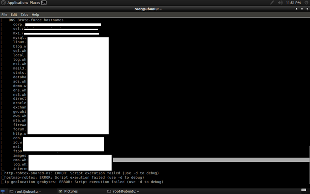
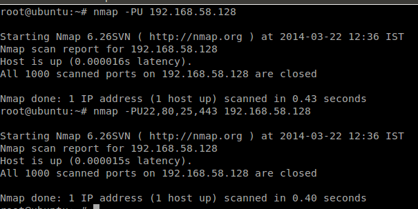
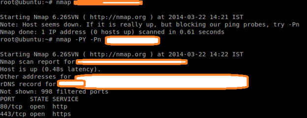
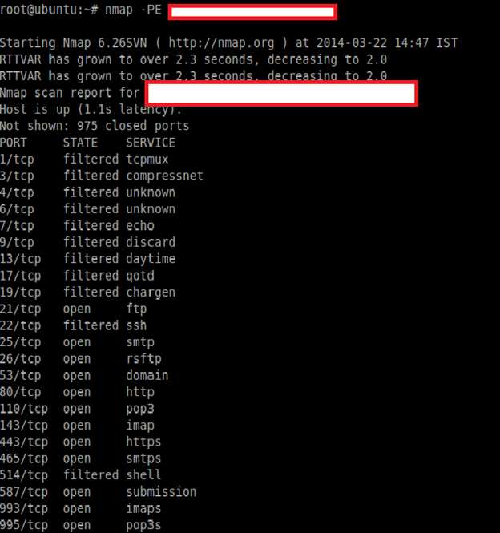
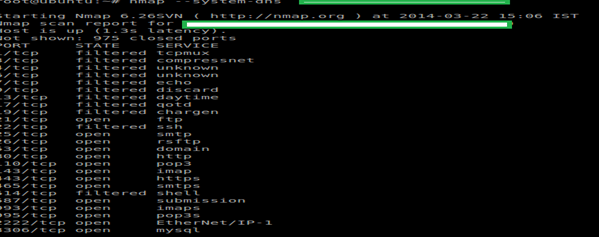

在侦查期间，扫描一直是信息收集的初始阶段。

##什么是侦查

侦查是尽可能多收集关于目标网络的信息。从黑客的角度来看，信息收集对于一次攻击非常有用，所以为了封锁恶意的企图，渗透测试者通常尽力查找这些信息，发现后修复这个缺陷。这也被叫做踩点。通过信息收集，人们通常会发现如下类型的信息：

- E-mail 地址
- 端口号/协议
- 操作系统信息
- 运行的服务
- Traceroute 信息/DNS 信息
- 防火墙标识和绕过
- 其他

所以对于信息收集，扫面是第一个部分。在扫面阶段，Nmap对于发现开放端口，协议号，操作系统信息，防火墙信息等是一个非常有用的工具。

##Nmap 介绍

Nmap (网络映射器)是一个开源工具，它使网络探测和安全审计得以专业化。最初由 Gordon “Fyodor” Lyon 发布。官网官方网站是[http://nmap.org](http://nmap.org). Nmap是一个免费的用来实现网络探测和安全审计的开源程序。许多系统和网络管理员发现它对于一些日常的工作也有帮助。例如查看整个网络的信息，管理服务升级计划以及监控主机和服务的正常运行。

Nmap采用一种新颖的方式利用原始IP包来决定网络上是什么样的主机，这些主机提供什么样的服务（应用程序名和版本），它们运行着什么样的操作系统（操作系统版本）它们使用什么类型的过滤器/防火墙以及许多其他的特征。它虽然被设计用来快速扫描大型网络，但是在单个主机上也会工作的非常好。Nmap可以运行在所有的主流计算机操作系统上，Linux，Windows，Mac OS X都可以找到官方的安装包。

##安装Nmap

Nmap has great support for different environments.

Windows: Install from the official site http://nmap.org For Windows, both GUI and command line options are available. The GUI option for Nmap is Zenmap.

Linux (Ubuntu and Debian): Fire the command in the Linux terminal: apt-get install nmap

In the below image, I have already installed Nmap.

For Red Hat and Fedora based systems: yum install nmap

For Gentoo Linux based systems: emerge nmap

Here, I will show everything in the Linux terminal.

##Nmap Scripting Engine

The Nmap Scripting Engine (NSE) is one of Nmap’s most powerful and flexible features. It allows users to write (and share) simple scripts to automate a wide variety of networking tasks. Basically these scripts are written in Lua programming language. Generally Nmap’s script engine does lots of things, some of them are below:

Network discovery

This is Nmap’s bread and butter. Examples include looking up WhoIs data based on the target domain, querying ARIN, RIPE, or APNIC for the target IP to determine ownership, performing identd lookups on open ports, SNMP queries, and listing available NFS/SMB/RPC shares and services.

Vulnerability detection

When a new vulnerability is discovered, you often want to scan your networks quickly to identify vulnerable systems before the bad guys do. While Nmap isn’t a comprehensive vulnerability scanner, NSE is powerful enough to handle even demanding vulnerability checks. Many vulnerability detection scripts are already available, and they plan to distribute more as they are written.

Many attackers and some automated worms leave backdoors to enable later reentry. Some of these can be detected by Nmap’s regular expression-based version detection.

Vulnerability exploitation

As a general scripting language, NSE can even be used to exploit vulnerabilities rather than just find them. The capability to add custom exploit scripts may be valuable for some people (particularly penetration testers), though they aren’t planning to turn Nmap into an exploitation framework such as Metasploit.

As you can see below, I have used (-sc) options (or –script), which is a default script scan for the target network. You can see we got ssh, rpcbind, netbios-sn but the ports are either filtered or closed, so we can say that may be there are some firewall which is blocking our request. Later we will discuss how to identify firewalls and try to evade them.

Now I m going to run a ping scan with discovery mode on (script) so that it will try all possible methods for scanning, that way I will get more juicy information.

As you can see in the image, it is trying all possible methods as per script rules. See the next image for more information.

Can you see the interesting ports and protocols? You can see dns-bruteforce found that host contains some blog, cms, sql, log, mail, and many more. So here we can perform SQL injection, the blog may be WordPress, Joomla, etc., so we can attack for a known CMS vulnerability, and obviously the method will be black-box pentesting.

In the upcoming chapter I will describe how to write your own Nmap script engine, and how to exploit them using Nmap.

##Basic Scanning Techniques

So here I will show the basic techniques for scanning network/host. But before that, you should know some basic stuff regarding Nmap status after scanning.

Port Status: After scanning, you may see some results with a port status like filtered, open, closed, etc. Let me explain this.

- Open: This indicates that an application is listening for connections on this port.
- Closed: This indicates that the probes were received but there is no application listening on this port.
- Filtered: This indicates that the probes were not received and the state could not be established. It also indicates that the probes are being dropped by some kind of filtering.
- Unfiltered: This indicates that the probes were received but a state could not be established.
- Open/Filtered: This indicates that the port was filtered or open but Nmap couldn’t establish the state.
- Closed/Filtered: This indicates that the port was filtered or closed but Nmap couldn’t establish the state.

##Let’s Scan Hosts

##Scan A Single Network

Go to your Nmap (either Windows/Linux) and fire the command: nmap 192.168.1.1(or) host name.

##Scan Multiple Network/Targets

In Nmap you can even scan multiple targets for host discovery/information gathering.

Command: map host1 host2 host3 etc….It will work for the entire subnet as well as different IP addresses.

You can also scan multiple website/domain names at a time with the same command. See the below picture. It will convert the domain name to its equivalent IP address and scan the targets.

##Scan a Range Of IP address

Command:nmap 192.168.2.1-192.168.2.100

Nmap can also be used to scan an entire subnet using CIDR (Classless Inter-Domain Routing) notation.

##Usage syntax: nmap [Network/CIDR]

Ex:nmap 192.168.2.1/24

##Scan a list of targets

If you have a large number of systems to scan, you can enter the IP address (or host names) in a text file and use that file as input for Nmap on the command line.

syntax: nmap -iL [list.txt]

##Scan Random Targets

The -iR parameter can be used to select random Internet hosts to scan. Nmap will randomly generate the specified number of targets and attempt to scan them.

syntax: nmap -iR [number of host]

It is not a good habit to do a random scan unless you have been given some project.

##The –exclude option is used with Nmap to exclude hosts from a scan.

syntax: nmap [targets] –exclude [host(s)]

ex:nmap 192.168.2.1/24 –exclude 192.168.2.10

##Aggressive Scan

The aggressive scan selects most commonly used options within Nmap to try to give a simple alternative to writing long strings. It will also work for traceroute, etc.

Command:nmap –A host

##Discovery With Nmap

Discovery with Nmap is very interesting and very helpful for penetration testers. During discovery one can learn about services, port numbers, firewall presence, protocol, operating system, etc. We will discuss one by one.

##Don’t Ping

The -PN option instructs Nmap to skip the default discovery check and perform a complete port scan on the target. This is useful when scanning hosts that are protected by a firewall that blocks ping probes.

Syntax:nmap –PN Target

By specifying these options, Nmap will discover the open ports without ping, which is the unpingable system.

##Ping Only Scan

The -Sp option is responsible for a ping only scan. It will be more useful when you have a group of IP addresses and you don’t know which one is reachable. By specifying a particular target, you can get even more information, like MAC address.

Syntax:nmap –Sp target

##TCP Syn Scan

Before we start, we must know the syn packet.

Basically a syn packet is used to initiate the connection between the two hosts.

The TCP SYN ping sends a SYN packet to the target system and listens for a response. This alternative discovery method is useful for systems that are configured to block standard ICMP pings.

The -PS option performs a TCP SYN ping.

Syntax:nmap –PS targets

The default port is port80. You can also specify other ports like –PS22, 23, 25, 443.

##TCP Ack Ping Scan

This type of scan will only scan of Acknowledgement(ACK) packet.

The -PA performs a TCP ACK ping on the specified target.

The -PA option causes Nmap to send TCP ACK packets to the specified hosts.

Syntax:nmap –PA target

This method attempts to discover hosts by responding to TCP connections that are nonexistent in an attempt to solicit a response from the target. Like other ping options, it is useful in situations where standard ICMP pings are blocked.

##UDP Ping scan

The –PU scan only on udp ping scans on the target. This type of scan sends udp packets to get a response.

Syntax:nmap –PU target

You can also specify the port number for scanning, like –PU 22, 80, 25, etc. In the above picture, the target is my LAN’s IP, which doesn’t have any UDP services.

##Sctp init ping

The -PY parameter instructs Nmap to perform an SCTP INIT ping. This option sends an SCTP packet containing a minimal INIT chunk. This discovery method attempts to locate hosts using the Stream Control Transmission Protocol (SCTP). SCTP is typically used on systems for IP based telephony.

Syntax:nmap –PY target

In the picture, though there is no sctp services on the machine, we have to use the –pn option for discovery.

##ICMP Echo ping

The -PE option performs an ICMP (Internet Control Message Protocol) echo ping on the specified system.

Syntax:nmap –PE target

This type of discovery works best on local networks where ICMP packets can be transmitted with few restrictions.

##ICMP Timestamp ping

The -PP option performs an ICMP timestamp ping.

##ICMP Address mask ping

The -PM option performs an ICMP address mask ping.

Syntax:nmap –PM target

This unconventional ICMP query (similar to the -PP option) attempts to ping the specified host using alternative ICMP registers. This type of ping can occasionally sneak past a firewall that is configured to block standard echo requests.

##IP Protocol Ping

The -PO option performs an IP protocol ping.

Syntax:nmap –PO protocol target

An IP protocol ping sends packets with the specified protocol to the target. If no protocols are specified, the default protocols 1 (ICMP), 2 (IGMP), and 4 (IP-in-IP) are used.

##ARP ping

The –PR option is used to perform an arp ping scan. The -PR option instructs Nmap to perform an ARP (Address Resolution Protocol) ping on the specified target.

SYTAX: nmap –PR target

The -PR option is automatically implied when scanning the local network. This type of discovery is much faster than the other ping methods.

Traceroute

The –traceroute parameter can be use to trace the network path to the specified host.

Syntax: nmap –traceroute target

##Force Reverse DNS Resolution

The -R parameter instructs Nmap to always perform a reverse DNS resolution on the target IP address.

Syntax: nmap –R target

The -R option is useful when performing reconnaissance on a block of IP addresses, as Nmap will try to resolve the reverse DNS information of every IP address.

##Disable Reverse DNS Resolution

The -n parameter is used to disable reverse DNS lookups.

Syntax:nmap –n target

Reverse DNS can significantly slow an Nmap scan. Using the -n option greatly reduces scanning times – especially when scanning a large number of hosts. This option is useful if you don’t care about the DNS information for the target system and prefer to perform a scan which produces faster results.

##Alternative DNS lookup method

The –system-dns option instructs Nmap to use the host system’s DNS resolver instead of its own internal method.

Syntax:nmap –system-dns target

##Manually Specify DNS server

The –dns-servers option is used to manually specify DNS servers to be queried when scanning.

Syntax: nmap –dns-servers server1 server2 target

The –dns-servers option allows you to specify one or more alternative servers for Nmap to query. This can be useful for systems that do not have DNS configured or if you want to prevent your scan lookups from appearing in your locally configured DNS server’s log file.

##List Scan

The -sL option will display a list and performs a reverse DNS lookup of the specified IP addresses.

Syntax:nmap –sL target

In the next installment, I will discuss how to discover services, host, and banners using different methods, and will also discuss how to find firewalls and how to evade them using NSE by Nmap, and how to write your own Nmap script engine. The most important part of Nmap is knowing how to find vulnerability and try to exploit them. Stay tuned.

##Reference

http://nmap.org/

*via*：http://resources.infosecinstitute.com/nmap-cheat-sheet/

*Copy:*

As always during reconnaissance, scanning is the initial stage for information gathering.

##What is Reconnaissance?

Reconnaissance is to collect as much as information about a target network as possible. From a hacker’s perspective, the information gathered is very helpful to make an attack, so to block that type of malicious attempt, generally a penetration tester tries to find the information and to patch the vulnerabilities, if found. This is also called Footprinting. Usually by information gathering, someone can find the below information:

- E-mail Address
- Port no/Protocols
- OS details
- Services Running
- Traceroute information/DNS information
- Firewall Identification and evasion
- And many more…

So for information gathering, scanning is the first part. For scanning, Nmap is a great tool for discovering Open ports, protocol numbers, OS details, firewall details, etc.

##Introduction To Nmap

Nmap (Network Mapper) is an open-source tool that specializes in network exploration and security auditing, originally published by Gordon “Fyodor” Lyon. The official website is (http://nmap.org). Nmap is a free and open source (license) utility for network discovery and security auditing. Many systems and network administrators also find it useful for tasks such as network inventory, managing service upgrade schedules, and monitoring host or service uptime.

Nmap uses raw IP packets in novel ways to determine what hosts are available on the network, what services (application name and version) those hosts are offering, what operating systems (and OS versions) they are running, what type of packet filters/firewalls are in use, and dozens of other characteristics. It was designed to rapidly scan large networks, but works fine against single hosts. Nmap runs on all major computer operating systems, and official binary packages are available for Linux, Windows, and Mac OS X.

##Installation Of Nmap

Nmap has great support for different environments.

Windows: Install from the official site http://nmap.org For Windows, both GUI and command line options are available. The GUI option for Nmap is Zenmap.

Linux (Ubuntu and Debian): Fire the command in the Linux terminal: apt-get install nmap

In the below image, I have already installed Nmap.

For Red Hat and Fedora based systems: yum install nmap

For Gentoo Linux based systems: emerge nmap

Here, I will show everything in the Linux terminal.

##Nmap Scripting Engine

The Nmap Scripting Engine (NSE) is one of Nmap’s most powerful and flexible features. It allows users to write (and share) simple scripts to automate a wide variety of networking tasks. Basically these scripts are written in Lua programming language. Generally Nmap’s script engine does lots of things, some of them are below:

Network discovery

This is Nmap’s bread and butter. Examples include looking up WhoIs data based on the target domain, querying ARIN, RIPE, or APNIC for the target IP to determine ownership, performing identd lookups on open ports, SNMP queries, and listing available NFS/SMB/RPC shares and services.

Vulnerability detection

When a new vulnerability is discovered, you often want to scan your networks quickly to identify vulnerable systems before the bad guys do. While Nmap isn’t a comprehensive vulnerability scanner, NSE is powerful enough to handle even demanding vulnerability checks. Many vulnerability detection scripts are already available, and they plan to distribute more as they are written.

Many attackers and some automated worms leave backdoors to enable later reentry. Some of these can be detected by Nmap’s regular expression-based version detection.

Vulnerability exploitation

As a general scripting language, NSE can even be used to exploit vulnerabilities rather than just find them. The capability to add custom exploit scripts may be valuable for some people (particularly penetration testers), though they aren’t planning to turn Nmap into an exploitation framework such as Metasploit.

As you can see below, I have used (-sc) options (or –script), which is a default script scan for the target network. You can see we got ssh, rpcbind, netbios-sn but the ports are either filtered or closed, so we can say that may be there are some firewall which is blocking our request. Later we will discuss how to identify firewalls and try to evade them.

Now I m going to run a ping scan with discovery mode on (script) so that it will try all possible methods for scanning, that way I will get more juicy information.

As you can see in the image, it is trying all possible methods as per script rules. See the next image for more information.

Can you see the interesting ports and protocols? You can see dns-bruteforce found that host contains some blog, cms, sql, log, mail, and many more. So here we can perform SQL injection, the blog may be WordPress, Joomla, etc., so we can attack for a known CMS vulnerability, and obviously the method will be black-box pentesting.

In the upcoming chapter I will describe how to write your own Nmap script engine, and how to exploit them using Nmap.

##Basic Scanning Techniques

So here I will show the basic techniques for scanning network/host. But before that, you should know some basic stuff regarding Nmap status after scanning.

Port Status: After scanning, you may see some results with a port status like filtered, open, closed, etc. Let me explain this.

- Open: This indicates that an application is listening for connections on this port.
- Closed: This indicates that the probes were received but there is no application listening on this port.
- Filtered: This indicates that the probes were not received and the state could not be established. It also indicates that the probes are being dropped by some kind of filtering.
- Unfiltered: This indicates that the probes were received but a state could not be established.
- Open/Filtered: This indicates that the port was filtered or open but Nmap couldn’t establish the state.
- Closed/Filtered: This indicates that the port was filtered or closed but Nmap couldn’t establish the state.

##Let’s Scan Hosts

##Scan A Single Network

Go to your Nmap (either Windows/Linux) and fire the command: nmap 192.168.1.1(or) host name.

##Scan Multiple Network/Targets

In Nmap you can even scan multiple targets for host discovery/information gathering.

Command: map host1 host2 host3 etc….It will work for the entire subnet as well as different IP addresses.

You can also scan multiple website/domain names at a time with the same command. See the below picture. It will convert the domain name to its equivalent IP address and scan the targets.

##Scan a Range Of IP address

Command:nmap 192.168.2.1-192.168.2.100

Nmap can also be used to scan an entire subnet using CIDR (Classless Inter-Domain Routing) notation.

##Usage syntax: nmap [Network/CIDR]

Ex:nmap 192.168.2.1/24

##Scan a list of targets

If you have a large number of systems to scan, you can enter the IP address (or host names) in a text file and use that file as input for Nmap on the command line.

syntax: nmap -iL [list.txt]

##Scan Random Targets

The -iR parameter can be used to select random Internet hosts to scan. Nmap will randomly generate the specified number of targets and attempt to scan them.

syntax: nmap -iR [number of host]

It is not a good habit to do a random scan unless you have been given some project.

##The –exclude option is used with Nmap to exclude hosts from a scan.

syntax: nmap [targets] –exclude [host(s)]

ex:nmap 192.168.2.1/24 –exclude 192.168.2.10

##Aggressive Scan

The aggressive scan selects most commonly used options within Nmap to try to give a simple alternative to writing long strings. It will also work for traceroute, etc.

Command:nmap –A host

##Discovery With Nmap

Discovery with Nmap is very interesting and very helpful for penetration testers. During discovery one can learn about services, port numbers, firewall presence, protocol, operating system, etc. We will discuss one by one.

##Don’t Ping

The -PN option instructs Nmap to skip the default discovery check and perform a complete port scan on the target. This is useful when scanning hosts that are protected by a firewall that blocks ping probes.

Syntax:nmap –PN Target

By specifying these options, Nmap will discover the open ports without ping, which is the unpingable system.

##Ping Only Scan

The -Sp option is responsible for a ping only scan. It will be more useful when you have a group of IP addresses and you don’t know which one is reachable. By specifying a particular target, you can get even more information, like MAC address.

Syntax:nmap –Sp target

##TCP Syn Scan

Before we start, we must know the syn packet.

Basically a syn packet is used to initiate the connection between the two hosts.

The TCP SYN ping sends a SYN packet to the target system and listens for a response. This alternative discovery method is useful for systems that are configured to block standard ICMP pings.

The -PS option performs a TCP SYN ping.

Syntax:nmap –PS targets

The default port is port80. You can also specify other ports like –PS22, 23, 25, 443.

##TCP Ack Ping Scan

This type of scan will only scan of Acknowledgement(ACK) packet.

The -PA performs a TCP ACK ping on the specified target.

The -PA option causes Nmap to send TCP ACK packets to the specified hosts.

Syntax:nmap –PA target

This method attempts to discover hosts by responding to TCP connections that are nonexistent in an attempt to solicit a response from the target. Like other ping options, it is useful in situations where standard ICMP pings are blocked.

##UDP Ping scan

The –PU scan only on udp ping scans on the target. This type of scan sends udp packets to get a response.

Syntax:nmap –PU target

You can also specify the port number for scanning, like –PU 22, 80, 25, etc. In the above picture, the target is my LAN’s IP, which doesn’t have any UDP services.

##Sctp init ping

The -PY parameter instructs Nmap to perform an SCTP INIT ping. This option sends an SCTP packet containing a minimal INIT chunk. This discovery method attempts to locate hosts using the Stream Control Transmission Protocol (SCTP). SCTP is typically used on systems for IP based telephony.

Syntax:nmap –PY target

In the picture, though there is no sctp services on the machine, we have to use the –pn option for discovery.

##ICMP Echo ping

The -PE option performs an ICMP (Internet Control Message Protocol) echo ping on the specified system.

Syntax:nmap –PE target

This type of discovery works best on local networks where ICMP packets can be transmitted with few restrictions.

##ICMP Timestamp ping

The -PP option performs an ICMP timestamp ping.

##ICMP Address mask ping

The -PM option performs an ICMP address mask ping.

Syntax:nmap –PM target

This unconventional ICMP query (similar to the -PP option) attempts to ping the specified host using alternative ICMP registers. This type of ping can occasionally sneak past a firewall that is configured to block standard echo requests.

##IP Protocol Ping

The -PO option performs an IP protocol ping.

Syntax:nmap –PO protocol target

An IP protocol ping sends packets with the specified protocol to the target. If no protocols are specified, the default protocols 1 (ICMP), 2 (IGMP), and 4 (IP-in-IP) are used.

##ARP ping

The –PR option is used to perform an arp ping scan. The -PR option instructs Nmap to perform an ARP (Address Resolution Protocol) ping on the specified target.

SYTAX: nmap –PR target

The -PR option is automatically implied when scanning the local network. This type of discovery is much faster than the other ping methods.

Traceroute

The –traceroute parameter can be use to trace the network path to the specified host.

Syntax: nmap –traceroute target

##Force Reverse DNS Resolution

The -R parameter instructs Nmap to always perform a reverse DNS resolution on the target IP address.

Syntax: nmap –R target

The -R option is useful when performing reconnaissance on a block of IP addresses, as Nmap will try to resolve the reverse DNS information of every IP address.

##Disable Reverse DNS Resolution

The -n parameter is used to disable reverse DNS lookups.

Syntax:nmap –n target

Reverse DNS can significantly slow an Nmap scan. Using the -n option greatly reduces scanning times – especially when scanning a large number of hosts. This option is useful if you don’t care about the DNS information for the target system and prefer to perform a scan which produces faster results.

##Alternative DNS lookup method

The –system-dns option instructs Nmap to use the host system’s DNS resolver instead of its own internal method.

Syntax:nmap –system-dns target

##Manually Specify DNS server

The –dns-servers option is used to manually specify DNS servers to be queried when scanning.

Syntax: nmap –dns-servers server1 server2 target

The –dns-servers option allows you to specify one or more alternative servers for Nmap to query. This can be useful for systems that do not have DNS configured or if you want to prevent your scan lookups from appearing in your locally configured DNS server’s log file.

##List Scan

The -sL option will display a list and performs a reverse DNS lookup of the specified IP addresses.

Syntax:nmap –sL target

In the next installment, I will discuss how to discover services, host, and banners using different methods, and will also discuss how to find firewalls and how to evade them using NSE by Nmap, and how to write your own Nmap script engine. The most important part of Nmap is knowing how to find vulnerability and try to exploit them. Stay tuned.

##Reference

http://nmap.org/

*via*：http://resources.infosecinstitute.com/nmap-cheat-sheet/

